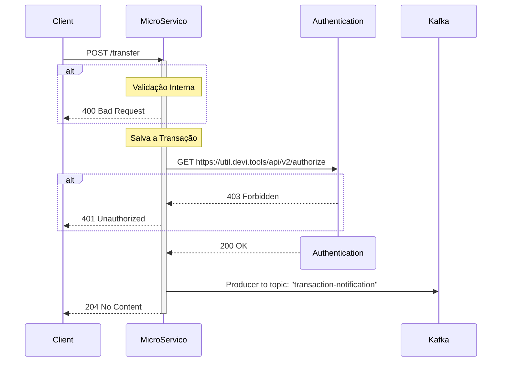
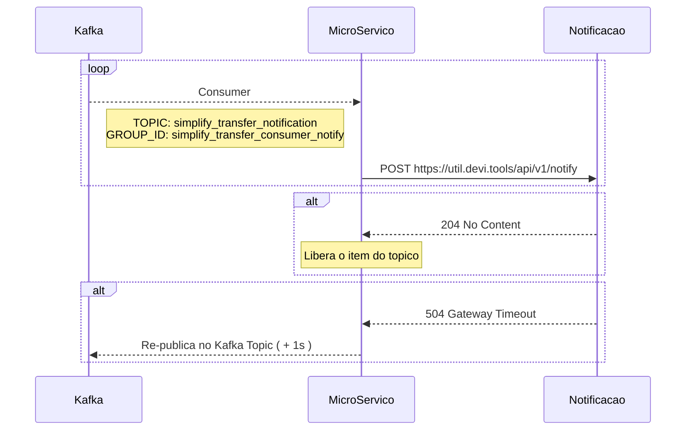

## Arquitetura:
---
#### Logica do processo:

```mermaid
sequenceDiagram
    participant Client
    participant MicroServico
    participant Authentication
    participant Kafka

    Client->>MicroServico: POST /transfer

    activate MicroServico
        alt 
            Note over MicroServico: Validação Interna
            MicroServico-->>Client: 400 Bad Request
        end

        Note over MicroServico: Salva a Transação
        MicroServico->>Authentication: GET https://util.devi.tools/api/v2/authorize

        alt 
            Authentication-->>MicroServico: 403 Forbidden
            MicroServico-->>Client: 401 Unauthorized
        end

        destroy Authentication
        Authentication-->>MicroServico: 200 OK
        MicroServico->>Kafka: Producer to topic: "transaction-notification"
        MicroServico-->>Client: 204 No Content
    deactivate MicroServico
        destroy Kafka

```
---
#### Logica de consumo do topico no Kafka:

```mermaid
sequenceDiagram
    participant Kafka
    participant MicroServico
    participant Notificacao

    loop 
        Kafka-->>MicroServico: Consumer
        Note right of Kafka: TOPIC: simplify_transfer_notification<br>GROUP_ID: simplify_transfer_consumer_notify

        MicroServico->>Notificacao: POST https://util.devi.tools/api/v1/notify
    end
    alt 
        Notificacao-->>MicroServico: 204 No Content
        Note over MicroServico: Libera o item do topico
    end
    alt 
        Notificacao-->>MicroServico: 504 Gateway Timeout
        MicroServico-->>Kafka: Re-publica no Kafka Topic ( + 1s )
    end
```
